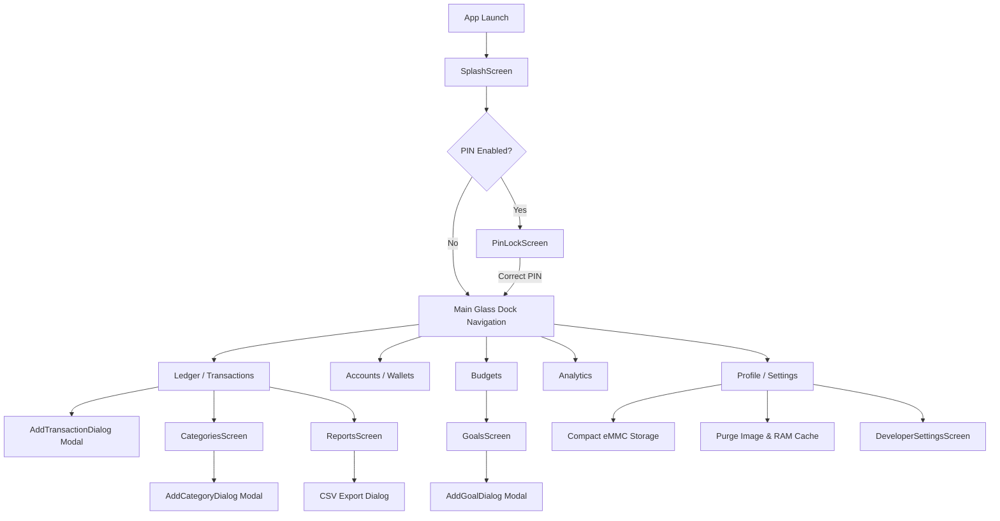
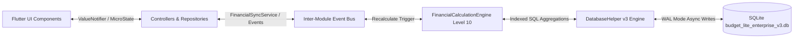

# Application Documentation: Budget Lite Pro (Enterprise Financial OS)

## 1. Application Overview

- **Purpose**: A commercial-grade, ultra-low-end optimized personal finance operating system. Built for instant startup (< 1 second) and high-performance execution on constrained hardware (eMMC storage, 1GB RAM) using an Apple VisionOS & macOS Big Sur inspired Glassmorphism UI engine.
- **Target Users**: Mobile (Android) and Desktop (Linux) users seeking a secure, offline-first personal financial operating system with zero latency, month-based data isolation, sub-category hierarchies, envelope budgeting, required monthly savings calculators, executive P&L statements, level 10 deterministic calculation engine, and automated cash flow analytics.
- **Platform(s)**: Android, Linux Desktop (GTK / Flutter FFI), Cross-Platform Flutter Desktop & Mobile.

---

## 2. Core Features

### Master Ledger & Level 10 Calculation Engine (Version 3)
- **Master Ledger**: Single source of truth database (`transactions`) for all financial records (Income, Expense, Transfer, Recurring, Loan, Investment).
- **Level 10 Calculation Engine (`FinancialCalculationEngine`)**: Real-time event-driven calculation pipeline triggering automatic SQL aggregation across Merchant, Category, Subcategory, Account, Budget, Goal, Net Worth, Cash Flow, Savings, Debt, Investment, Monthly Snapshot, Quarter, Year, Analytics, Financial Score (0–100), Forecast, and Insights engines.
- **Extended Ledger Fields**: Merchant title autocomplete, location, sub-categories, exchange rates, reference numbers, scheduled dates, and notes.
- **Paginated Ledger View**: High-performance scrolling with 50-item page size and infinite scroll fetching.

### Financial Score (0–100) & Forecast Engine
- **Deterministic Financial Score (0–100)**: Multi-factor weighted score calculated from savings rate %, budget health, net worth, and cash flow ratio:
  $$\text{Score} = \text{clamp}\left(0, 100, 40 \times \text{SavingsRateRatio} + 35 \times \text{CashFlowRatio} + 25 \times \text{NetWorthRatio}\right)$$
- **Forecast Engine**: Linear trend projection predicting Next Month Expense, Income, and Net Cash Flow.

### Month-Based Data Engine
- **Global Month Selector Bar**: Interactive header (`< February 2026 >`) embedded across screens allowing instant month/year selection.
- **Application-Wide Month Filtering**: Changing the active month recalculates all balances, charts, categories, budget health scores, and report statements dynamically without app restarts.

### Sub-Category Taxonomy & Custom Categories
- **Hierarchical Category Engine**: Nested sub-categories (e.g. `Food & Dining` -> `Groceries`, `Restaurants`, `Coffee`) with parent-child rollups.
- **Custom Taxonomy Manager**: Category management screen (`CategoriesScreen`) to view, add, and delete custom categories and sub-categories.
- **Add Custom Category Dialog**: Interactive modal with parent category selector, custom icon picker, color palette selector, and type classification.

### Multi-Account & Net Worth Engine
- **Multi-Account Tracking**: Real-time balance calculations across Cash, Main Checking, High-Yield Savings, and Credit Cards with credit limits and opening balances.
- **Net Worth Aggregation**: Computes total liquid net worth across all active account balances.

### Envelope Budgets & Goal Tracking
- **Envelope Budget Caps**: Monthly budget allocation with envelope carry-forward overspend adjustments.
- **Budget Health Score (0–100)**: Real-time budget health score indicator based on total envelope usage ratio.
- **Financial Savings Goals**: Savings goals manager (`GoalsScreen`, `AddGoalDialog`) featuring an automated **Required Monthly Savings Calculator** ($\frac{\text{Target} - \text{Current}}{\text{Months Remaining}}$) and deadline remaining days indicators.

### Analytics & Visual Insights
- **Donut Expense Chart**: Native Canvas `GpuPieChartPainter` displaying category expense allocation.
- **Automated Insights Engine**: Calculates daily spend burn rate, savings percentage rate, top outflow category, and cash flow alerts.

### Executive Financial Statements & Data Backup
- **Tabbed Financial Statements**:
  - **Executive Summary**: Overall cash flow (Inflows, Outflows, Net Cash Flow) and top category expense ranking.
  - **Income Statement (P&L)**: Gross Revenue vs Operating Expenses.
  - **Cash Flow Statement**: Net Operating Cash Flow calculation.
- **CSV Data Exporter**: Exports filtered month or ledger transaction data into RFC-4180 compliant CSV format.
- **Relational JSON Backup & Restore**: Full database backup and restore service preserving transaction, sub-category, budget, goal, and account relationships.

### Security & Appearance
- **Security PIN Lock**: 4-digit PIN lock screen (`PinLockScreen`) featuring an animated numeric keypad, passcode dots, and error shake animations.
- **Glassmorphism Theme System**: Reactive `ThemeProvider` toggling between Dark Slate Sapphire & Light Frosted Glass aesthetics.

---

## 3. Module Breakdown

| Module | Status | Primary Responsibilities |
| :--- | :--- | :--- |
| **Calculation Engine** | Completed | Deterministic Level 10 engine driving real-time metric updates across all modules (`FinancialCalculationEngine`). |
| **Authentication** | Completed | Manages initial splash sequence and 4-digit security PIN verification (`PinLockScreen`). |
| **Dashboard** | Completed | Displays active month net balance, credit-card balance card, metrics, month picker, and smart financial insights. |
| **Ledger / Transactions** | Completed | Master transaction ledger with paginated list, live search, filter chips, and transaction creation sheet. |
| **Categories** | Completed | System category definitions, sub-category hierarchy, and custom category manager (`CategoriesScreen`). |
| **Monthly Data** | Completed | Central `MonthSelectorController` driving active month selection and inter-module event synchronization (`FinancialSyncService`). |
| **Budgets** | Completed | Envelope budget limits, carry-forwards, progress bars, and Budget Health Score (`BudgetsScreen`). |
| **Accounts** | Completed | Multi-account wallet manager, checking, credit card limits, and net worth overview (`AccountsScreen`). |
| **Goals** | Completed | Savings goals manager with required monthly savings calculator and progress tracks (`GoalsScreen`, `AddGoalDialog`). |
| **Analytics** | Completed | Category donut chart, daily average burn rate, savings rate %, and next month forecast (`AnalyticsScreen`). |
| **Reports** | Completed | Tabbed financial statements (Summary, P&L, Cash Flow) and CSV export dialog (`ReportsScreen`). |
| **Backup / Restore** | Completed | Full JSON database backup export and restoration service (`DataExporter`). |
| **Settings** | Completed | User profile header, theme toggle, eMMC database compaction (VACUUM), memory cache purging, and test data seeder (`SettingsScreen`). |
| **Developer Settings** | Completed | Diagnostic metrics, frame rate monitors, and eMMC query monitors (`DeveloperSettingsScreen`). |

---

## 4. Feature Matrix

| Feature Name | Status | Description | Related Screens | Related APIs | Related Models | Dependencies |
| :--- | :--- | :--- | :--- | :--- | :--- | :--- |
| **Level 10 Calculation Pipeline** | Completed | Real-time SQL aggregations for Score, Forecasts, & Net Worth | All Screens | `FinancialCalculationEngine` | `FinancialMetrics` | `sqflite` |
| **PIN Lock Verification** | Completed | 4-digit security PIN verification with error shake feedback | `PinLockScreen` | Local Database | `User` | Flutter AnimationController |
| **Month Selector Header** | Completed | Global month/year picker updating all active views | All Main Screens | `MonthSelectorController` | N/A | `AppFormatters` |
| **Master Ledger View (v3)** | Completed | Paginated view of transactions with sub-categories & merchants | `TransactionsScreen` | `DatabaseHelper` | `TransactionModel` | `sqflite` / `sqflite_common_ffi` |
| **Add Transaction Sheet** | Completed | Frosted glass sheet for logging expenses, income, & sub-categories | `AddTransactionDialog` | `TransactionRepository` | `TransactionModel` | `GlassCard`, `GlassInput` |
| **Sub-Category Hierarchy** | Completed | Add & manage parent categories and nested sub-categories | `CategoriesScreen`, `AddCategoryDialog` | `CategoryRepository` | `CategoryModel` | `GlassCard`, `GlassButton` |
| **Envelope Budgets & Health Score** | Completed | Envelope budget allocation, health score (0-100), and progress tracks | `BudgetsScreen` | `BudgetRepository` | `BudgetModel` | `AnimatedCircularProgress` |
| **Savings Goal Monthly Calculator** | Completed | Goal manager with required monthly savings calculator | `GoalsScreen`, `AddGoalDialog` | `GoalRepository` | `GoalModel` | `GlassCard`, `GlassInput` |
| **Account Net Worth** | Completed | Real-time net worth calculation across active wallets & credit cards | `AccountsScreen` | `AccountRepository` | `AccountModel` | `AppDatabase` / `AccountDao` |
| **Automated Insights** | Completed | Rule-based financial insights generator and burn rate tracker | `DashboardHeader` | `InsightsEngine` | N/A | `DatabaseHelper` |
| **Tabbed Financial Statements** | Completed | Executive summary, P&L statement, and Cash Flow statement | `ReportsScreen` | `DatabaseHelper` | N/A | `AppFormatters` |
| **CSV Exporter** | Completed | Exports transactions to standard CSV format | `ReportsScreen` | `DataExporter` | `TransactionModel` | `DatabaseHelper` |
| **JSON Backup & Restore** | Completed | Exports and restores complete relational database backup | `SettingsScreen` | `DataExporter` | All Models | `dart:convert`, `sqflite` |
| **eMMC Compaction** | Completed | Compacts SQLite database file via native `VACUUM` | `SettingsScreen` | `DatabaseHelper` | N/A | `sqflite` |

---

## 5. User Flow



---

## 6. Data Flow



---

## 7. Architecture Summary

```
lib/
├── app/
│   └── main_app.dart              # Root MaterialApp, tab switching, and shell layout
├── core/
│   ├── database/
│   │   ├── app_database.dart      # Relational SQLite database service
│   │   └── database_helper.dart   # Unified master ledger database engine (Version 3)
│   ├── services/
│   │   ├── data_exporter.dart     # CSV exporter and JSON backup/restore service
│   │   ├── financial_calculation_engine.dart # Level 10 Deterministic Calculation Engine
│   │   ├── financial_metrics.dart # Master calculated financial metrics model
│   │   ├── financial_sync_service.dart # Real-time inter-module sync event bus
│   │   └── insights_engine.dart   # Automated financial insights generator
│   ├── state/
│   │   ├── micro_notifier.dart    # Zero-overhead lightweight reactive state holder
│   │   └── month_selector_controller.dart # Application-wide active month controller
│   ├── theme/
│   │   ├── app_colors.dart        # Curated color system and gradient tokens
│   │   ├── app_spacing.dart       # Spacing, radius, and shadow tokens
│   │   ├── app_theme.dart         # Material 3 light/dark ThemeData
│   │   ├── app_typography.dart    # Modern typography scale
│   │   ├── glass_tokens.dart      # Backdrop filter blur and frosted glass opacities
│   │   └── theme_provider.dart    # Dynamic light/dark theme switcher
│   ├── utils/
│   │   ├── formatters.dart        # Custom currency and date formatters
│   │   └── memory_optimizer.dart  # RAM cache optimizer
│   └── widgets/
│       ├── glass/                 # Reusable VisionOS glassmorphism component system
│       │   ├── ambient_background.dart # Dynamic floating blurred color blob background
│       │   ├── glass_bottom_bar.dart   # Floating glass navigation dock
│       │   ├── glass_bottom_sheet.dart # Glass modal sheet wrapper
│       │   ├── glass_button.dart       # Frosted glass action button
│       │   ├── glass_card.dart         # Glass card container with scale animations
│       │   ├── glass_chip.dart         # Frosted glass filter chip
│       │   ├── glass_container.dart    # Base BackdropFilter glass surface
│       │   └── glass_input.dart       # Glass text field with focus glow
│       └── month_selector_bar.dart # Glassmorphic interactive month header bar
└── features/
    ├── accounts/                  # Multi-account wallet module
    ├── analytics/                 # Category donut chart and analytics screen
    ├── authentication/            # Splash screen and PIN lock screen
    ├── budgets/                   # Category budgets and progress indicators
    ├── categories/                # Custom categories and sub-category dialog
    ├── dashboard/                 # Overview balance card and metrics header
    ├── developer_settings/        # Diagnostic tools and frame rate monitor
    ├── goals/                     # Savings goals, dialogs, and required savings calculator
    ├── reports/                   # Executive P&L, Cash Flow, and CSV exporter
    ├── settings/                  # Profile settings, backup/restore, and maintenance
    └── transactions/              # Master transaction ledger screen and dialogs
```

---

## 8. Screens

| Screen Class | File Path | Purpose | Key Features | Navigation Path |
| :--- | :--- | :--- | :--- | :--- |
| `SplashScreen` | `lib/features/authentication/presentation/screens/splash_screen.dart` | Initial launch screen | Brand badge, version info, fade transition | Root -> Splash |
| `PinLockScreen` | `lib/features/authentication/presentation/screens/pin_lock_screen.dart` | Security verification | Animated keypad, passcode dots, error shake | Splash -> PinLock |
| `TransactionsScreen` | `lib/features/transactions/presentation/transactions_screen.dart` | Main ledger view | Paginated list, live search, filter chips, FAB | Tab 0 (Ledger) |
| `AccountsScreen` | `lib/features/accounts/presentation/screens/accounts_screen.dart` | Wallet manager | Net worth header, account tiles, credit card limits | Tab 1 (Wallets) |
| `BudgetsScreen` | `lib/features/budgets/presentation/screens/budgets_screen.dart` | Envelope budget tracker | Health Score (0-100), envelope cards, limit progress bars | Tab 2 (Budgets) |
| `AnalyticsScreen` | `lib/features/analytics/presentation/screens/analytics_screen.dart` | Visual analytics | Category donut chart, legend, burn rate stat cards | Tab 3 (Analytics) |
| `SettingsScreen` | `lib/features/settings/presentation/settings_screen.dart` | Profile & options | Profile header, theme mode switch, eMMC compaction | Tab 4 (Profile) |
| `CategoriesScreen` | `lib/features/categories/presentation/categories_screen.dart` | Custom categories | Sub-categories list, delete & create parent/sub shortcuts | Ledger -> Categories |
| `ReportsScreen` | `lib/features/reports/presentation/reports_screen.dart` | Financial statements | Tabbed P&L, Cash Flow statement, top category ranking, CSV export | Ledger -> Reports |
| `GoalsScreen` | `lib/features/goals/presentation/goals_screen.dart` | Savings goals | Goal progress tracks, required monthly savings badges | Budgets -> Goals |
| `DeveloperSettingsScreen` | `lib/features/developer_settings/presentation/screens/developer_settings_screen.dart` | Diagnostics | Frame rate stats, query latency monitors | Profile -> Dev Settings |

---

## 9. Business Rules & Calculation Formulas

1. **Single Source of Truth**: All transaction calculations (income, expense, net balance, category spent amounts, account balances) derive exclusively from SQLite `transactions` records.
2. **Month Isolation**: Every transaction record contains integer `month` (1–12) and `year` fields. Selecting a month in `MonthSelectorController` isolates all dashboard totals, transaction lists, budgets, analytics, and reports to that month.
3. **Net Balance Formula**: $\text{Net Balance} = \sum \text{Income Amounts} - \sum \text{Expense Amounts}$.
4. **Savings Rate Formula**: $\text{Savings Rate} = \frac{\text{Income} - \text{Expense}}{\text{Income}} \times 100\%$ (clamped to $0\% \text{--} 100\%$).
5. **Required Monthly Savings Formula**: $\text{Monthly Savings} = \frac{\text{Target Amount} - \text{Current Savings}}{\text{Months Remaining}}$.
6. **Budget Health Score Formula**: $\text{Score} = \left(1.0 - \min\left(1.0, \frac{\text{Total Spent}}{\text{Total Limit}}\right)\right) \times 100$.
7. **Level 10 Financial Score Formula**: $\text{Score} = \text{clamp}\left(0, 100, 40 \times \text{SavingsRateRatio} + 35 \times \text{CashFlowRatio} + 25 \times \text{NetWorthRatio}\right)$.
8. **SQLite Storage Performance**: SQLite operates with `PRAGMA journal_mode = WAL;` and `PRAGMA synchronous = NORMAL;` to eliminate write amplification and prevent main thread blocking on slow eMMC flash memory.

---

## 10. Integrations

- **Flutter SDK**: Framework engine for cross-platform UI rendering.
- **SQLite (`sqflite` & `sqflite_common_ffi`)**: Local embedded relational database engine for Android and Linux Desktop FFI.
- **Path (`path`)**: Cross-platform file system path resolution.
- **Flutter Test (`flutter_test`)**: Automated unit testing and widget testing framework.

---

## 11. Configuration

- **Database File**: `budget_lite_enterprise_v3.db` (Version 3).
- **Journal Mode**: WAL (Write-Ahead Logging).
- **Theme Modes**: Reactive system / dark / light mode via `ThemeProvider`.
- **Target SDK**: Dart SDK `>=3.0.0 <4.0.0`.

---

## 12. Current Limitations

- **Cloud Synchronization**: Application operates strictly offline-first. Remote cloud backup or multi-device real-time sync is currently not included.
- **Receipt Attachment View**: Transaction model supports `attachment_path`, but full image preview viewer is pending UI extension.

---

## 13. Future Scope

- [ ] Biometric authentication (Fingerprint / Face ID integration).
- [ ] Direct PDF report generator for monthly statement printing.
- [ ] Multi-currency real-time conversion API integration.
- [ ] Automated scheduled bill reminder notifications.

---

## 14. Technical Stack

- **Framework**: Flutter 3.x
- **Language**: Dart 3.x
- **State Management**: `ValueNotifier` & custom `MicroState`
- **Database**: SQLite (`sqflite` / `sqflite_common_ffi` with WAL mode v3 schema)
- **Architecture**: Modular Clean Architecture (Core / Domain / Data / Services / Presentation)
- **UI System**: Custom VisionOS Frosted Glassmorphism (`BackdropFilter`, `AmbientBackground`, `GlassCard`)
- **Testing**: `flutter_test`

---

## 15. Project Statistics

- **Number of Modules**: 12 (including Level 10 Calculation Engine)
- **Number of Primary Screens**: 11
- **Number of Reusable Components**: 16 (8 Core Widgets + 8 Glass Components)
- **Number of Remote APIs**: 0 (100% Offline-First Architecture)
- **Number of Core Services**: 4 (`FinancialCalculationEngine`, `FinancialSyncService`, `InsightsEngine`, `DataExporter`)
- **Number of Data Models**: 6 (`FinancialMetrics`, `TransactionModel`, `AccountModel`, `BudgetModel`, `CategoryModel`, `GoalModel`)
- **Number of Utilities**: 2 (`AppFormatters`, `MemoryOptimizer`)
